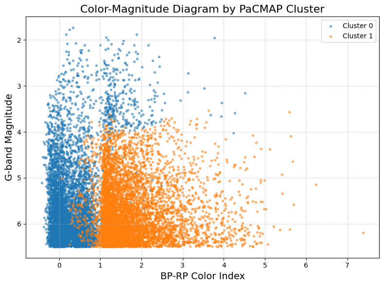
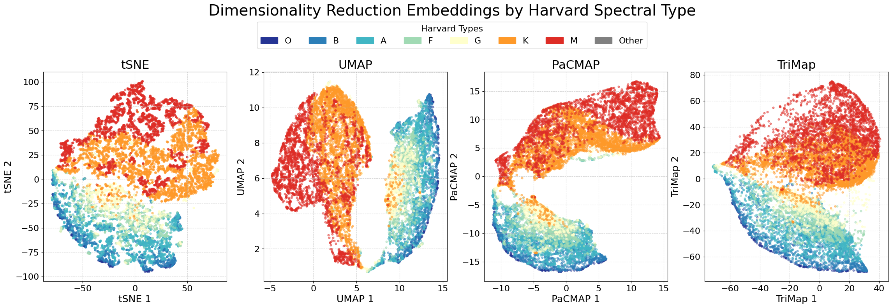
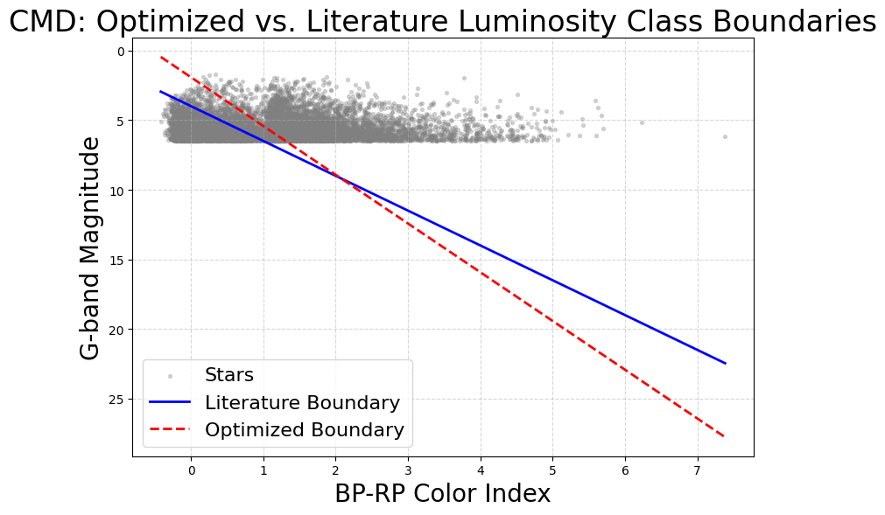
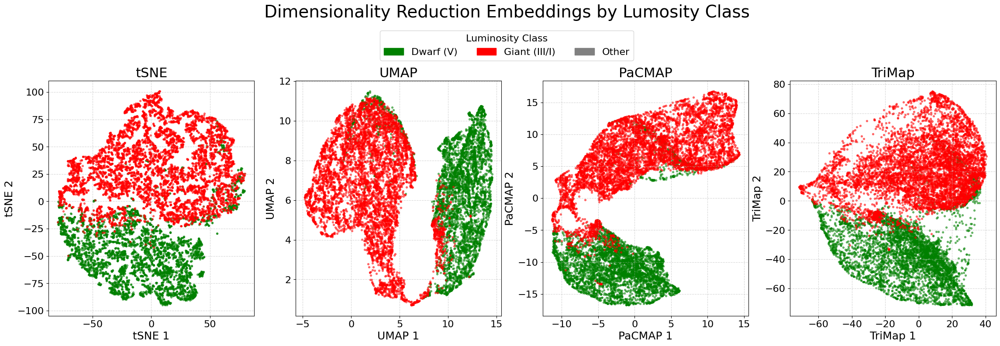
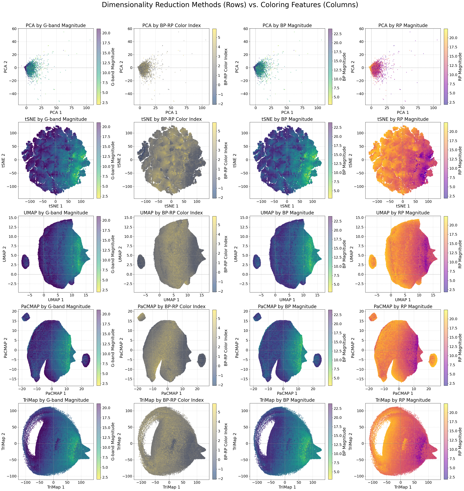
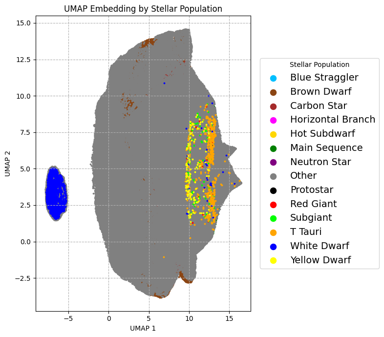
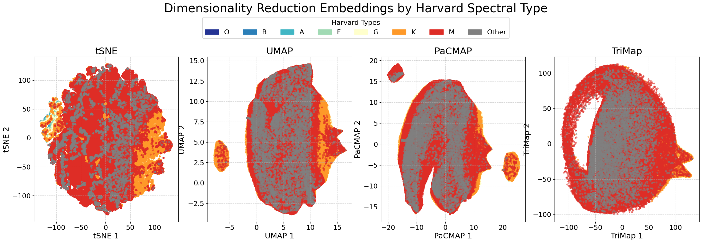
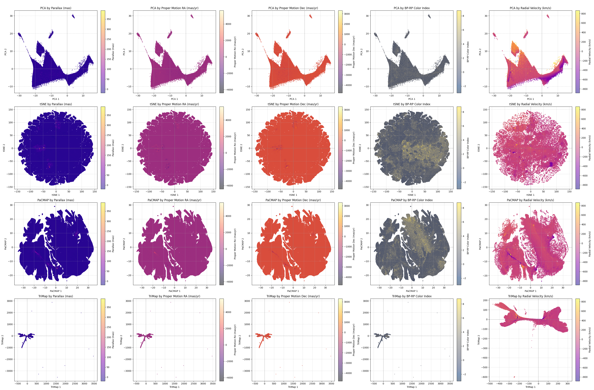
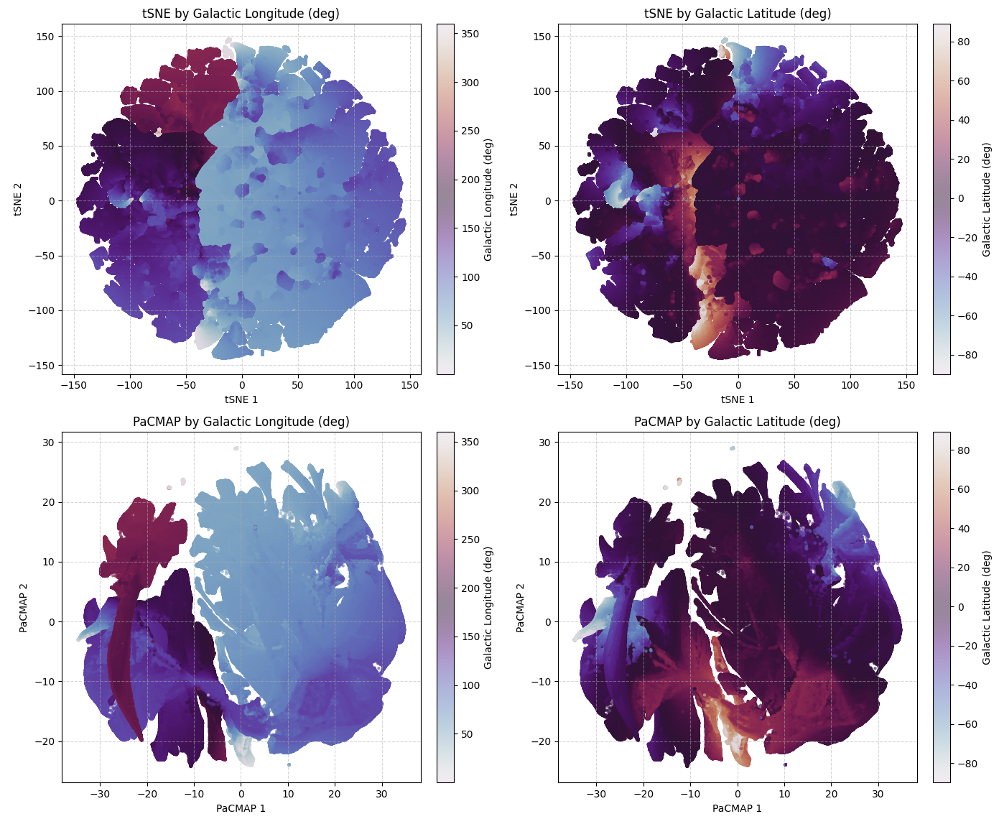

# Dimensionality Reduction on Gaia DR3

*This project has been completed as part of the Large Scale Computing subject at AGH University.*

## Overview
This project explores the application of modern dimensionality reduction (DR) techniques to the Gaia DR3 dataset, focusing on three main experiments:

1. **Stars visible from Earth** (apparent magnitude < 6.5)
2. **High proper motion stars** (proper motion > 50 mas/yr)
3. **Spatial analysis of outliers** (2,000,000 stars)

The analysis leverages methods such as PCA, t-SNE, UMAP, PaCMAP, and TriMap to reveal astrophysically meaningful structures in the data. The results are visualized and interpreted using color-magnitude diagrams (CMDs), clustering, and stellar classification schemes.

## Experiments and Results

### 1. Stars Visible from Earth
- **Dataset:** 12,119 stars with apparent magnitude < 6.5
- **Goal:** Explore the structure of bright stars as seen by the naked eye.

#### Dimensionality Reduction

#### CMD and Harvard Classification
CMD (Color-Magnitude Diagram) and Harvard spectral types are visualized:

#### Luminosity Boundaries
Comparison of literature and optimized boundaries for separating dwarfs and giants:

##### Why Two Clusters?
- The two main clusters correspond to giant stars and dwarf (main sequence) stars.
- Giants are more luminous and larger but less common; dwarfs are more numerous and less luminous.
- The difference in luminosity and size creates a clear separation in DR plots.

---

### 2. High Proper Motion Stars
- **Dataset:** 500,000 stars with proper motion > 50 mas/yr
- **Goal:** Identify unique populations among fast-moving stars.

#### Dimensionality Reduction

#### Harvard Classification and Stellar Population

##### Why White Dwarves Stand Out?
- White dwarves are hot but faint remnants of stars, physically distinct from main sequence and giant stars.
- Their unique properties make them form a small, separate cluster in DR plots.

---

### 3. Spatial Analysis (Outliers)
- **Dataset:** 2,000,000 stars selected as outliers by various criteria (e.g., high proper motion, extreme colors, low parallax significance, etc.)
- **Goal:** Investigate spatial clustering and the nature of outlier stars.

#### Dimensionality Reduction

#### Galactic Coordinates

##### Why Galactic Longitude Clusters?
- The sample is dominated by unusual or rare objects (halo stars, high-velocity stars, or sources with problematic measurements).
- Clustering by galactic longitude reflects both the spatial distribution of outliers and the structure of the Milky Way, as well as survey selection effects.

## Conclusions
- Dimensionality reduction reveals clear, physically meaningful structures in Gaia DR3 data.
- The separation between giants and dwarfs is driven by intrinsic differences in luminosity and size.
- High proper motion analysis highlights the unique properties of white dwarves.
- Spatial analysis uncovers clustering by galactic longitude, shaped by both astrophysical and observational factors.
- These results demonstrate how astrophysical properties and observational biases shape the patterns seen in large astronomical datasets.

## How to Run
1. **Install dependencies:**
   - All required Python packages are listed in `pyproject.toml` and `uv.lock`.
   - Use your preferred package manager (e.g., `pip`, `uv`, or `poetry`) to install them.
2. **Run the notebooks:**
   - Open any of the provided notebooks (e.g., `gaia_visible_from_earth.ipynb`) in Jupyter or VS Code.
   - Execute the cells to reproduce the analysis and figures.

## Acknowledgement
- Data: [Gaia DR3](https://www.cosmos.esa.int/web/gaia/dr3)
